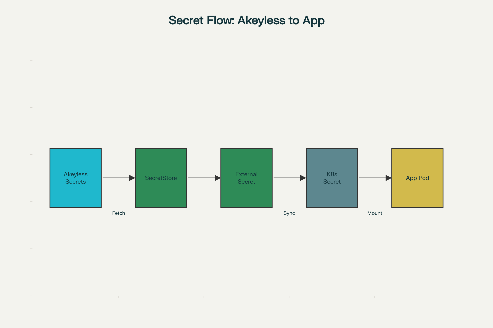

# Chapter 1 – Why AKS + Akeyless + External Secrets Operator

Kubernetes applications need secrets (passwords, API keys, tokens, certificates), but native Kubernetes Secrets only base64‑encode values and do not provide full lifecycle management, strong encryption, or centralized governance.

Akeyless and External Secrets Operator (ESO) together solve this by separating “secret management” from “secret consumption.” Akeyless is the central place where secrets are stored, protected, rotated, and audited, while ESO is a Kubernetes operator that syncs those secrets into Kubernetes Secrets inside AKS so applications can use them without any code changes.

---

## High-Level Architecture Diagram

---

## Problems with native Kubernetes Secrets

- Secrets are only base64‑encoded and, by default, stored unencrypted in etcd unless extra encryption is enabled.  
- Rotation is manual and repetitive: each change needs YAML updates, `kubectl apply`, and often application restarts or redeployments.  
- There is no central view across clusters and environments, so security teams cannot easily enforce consistent policies and audit how secrets are used.

---

## What Akeyless adds

- Akeyless securely stores secrets, keys, and certificates with strong encryption and zero‑knowledge design, and provides fine‑grained RBAC and policies for access.  
- It offers lifecycle features such as automated rotation, dynamic credentials, audit logs, and integrations with CI/CD, cloud providers, and Kubernetes.

---

## What External Secrets Operator does

- ESO introduces CRDs like `SecretStore` / `ClusterSecretStore` (how to connect to a provider) and `ExternalSecret` (what to fetch and how to map it into a Kubernetes Secret).  
- The ESO controller runs in the cluster, calls the external API (Akeyless), and reconciles Kubernetes Secrets so applications see up‑to‑date values.

---

## How AKS, Akeyless, and ESO work together

1. A secret is created and maintained in Akeyless (e.g., database password for an app).  
2. A `SecretStore` or `ClusterSecretStore` in AKS defines how ESO talks to Akeyless.  
3. An `ExternalSecret` declares which Akeyless secret to pull and the target Kubernetes Secret name.  
4. ESO fetches the value and updates the Kubernetes Secret, which the pod consumes normally.

---

## What the next chapters will cover

This first chapter focused on “why” and high-level architecture. The next chapters in the wiki will go deeper into:

- Authentication patterns between AKS and Akeyless (especially Kubernetes Auth) and how they work.  
- A full step-by-step lab: installing ESO on AKS, configuring Akeyless, creating `SecretStore` and `ExternalSecret` manifests, and verifying sync and rotation.  
